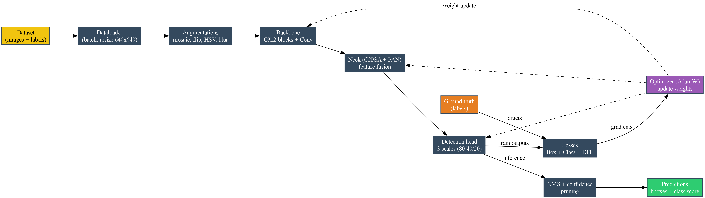

# Robust Lightweight Tiny UAV Detection Using YOLO11


A lightweight and robust deep learning framework for detecting tiny Unmanned Aerial Vehicles (UAVs) using **YOLO11**. This project focuses on improving the detection accuracy of very small drones while maintaining real-time inference performance suitable for surveillance, defense, and security applications.

---

# Project Overview

Tiny UAV detection is a challenging computer vision task because drones usually occupy only a small portion of an image and can easily blend into complex backgrounds such as skies, buildings, vegetation, and varying lighting conditions.

This Final Year Project presents a robust and lightweight object detection framework based on **YOLO11**, designed to improve the detection of tiny UAVs while maintaining computational efficiency for near real-time applications.

The project covers the complete deep learning workflow, including dataset preparation, preprocessing, model training, evaluation, and performance analysis.

---

# Features

- Tiny UAV detection using YOLO11
- Lightweight architecture for real-time inference
- Optimized for small object detection
- Complete training and validation pipeline
- Performance evaluation using Precision, Recall, mAP, and F1-Score
- Confusion Matrix and Loss Analysis
- Prediction visualization
- Well-organized project structure

---

# Repository Structure

```text
Robust-Lightweight-Tiny-UAV-Detection/
│
├── architecture/
├── dataset/
├── notebooks/
├── references/
├── results/
├── weights/
│
├── README.md
├── requirements.txt
├── LICENSE
└── .gitignore
```

---

# Model Architecture

The proposed UAV detection framework is based on the **YOLO11** object detection architecture with modifications designed to improve tiny object localization while maintaining lightweight computation.

<p align="center">
  
</p>

---

# Dataset

The model was trained using a UAV object detection dataset prepared in YOLO format.

The dataset includes:

- Training images
- Validation images
- Testing images
- Bounding box annotations
- Dataset configuration files

For licensing reasons, the complete dataset is not included in this repository. Dataset documentation is available in the `dataset/` directory.

---

# Training

The complete implementation is provided in the Jupyter notebook:

```text
notebooks/robust_lightweight_tiny_uav_detection.ipynb
```

The notebook includes:

- Dataset preparation
- Data preprocessing
- Model training
- Validation
- Performance evaluation
- Prediction generation

---

# Evaluation Metrics

The model is evaluated using:

- Precision
- Recall
- mAP@0.5
- mAP@0.5:0.95
- F1-Score
- Precision-Recall Curve
- Confusion Matrix
- Training & Validation Loss

---

# Results

The repository contains:

- Training metrics
- Precision-Recall curves
- F1 Score curves
- Confusion matrices
- Validation predictions
- Training predictions
- Comprehensive performance dashboards

Example outputs are available in the `results/` directory.

---

# Technologies Used

- Python
- YOLO11 (Ultralytics)
- PyTorch
- OpenCV
- NumPy
- Pandas
- Matplotlib
- Jupyter Notebook

---

# Installation

Clone the repository:

```bash
git clone https://github.com/YOUR_USERNAME/Robust-Lightweight-Tiny-UAV-Detection.git
```

Move into the project directory:

```bash
cd Robust-Lightweight-Tiny-UAV-Detection
```

Install the required dependencies:

```bash
pip install -r requirements.txt
```

---

# Usage

Launch the notebook:

```bash
jupyter notebook notebooks/robust_lightweight_tiny_uav_detection.ipynb
```

Follow the notebook cells to train, validate, or evaluate the model.

---

# Future Improvements

- Real-time UAV tracking
- Edge device deployment
- Multi-class aerial object detection
- Model compression and optimization
- Integration with surveillance systems

---

# References

Research papers and supporting literature are available in the `references/` directory.

---

# Author

**Talib Saleem**

Bachelor of Science in Data Science

Final Year Project

---

# Acknowledgements

Special thanks to:

- Project Supervisor
- Department of Computer Science
- Ultralytics YOLO
- Roboflow
- Open Source Computer Vision Community

---

# License

This project is licensed under the MIT License.